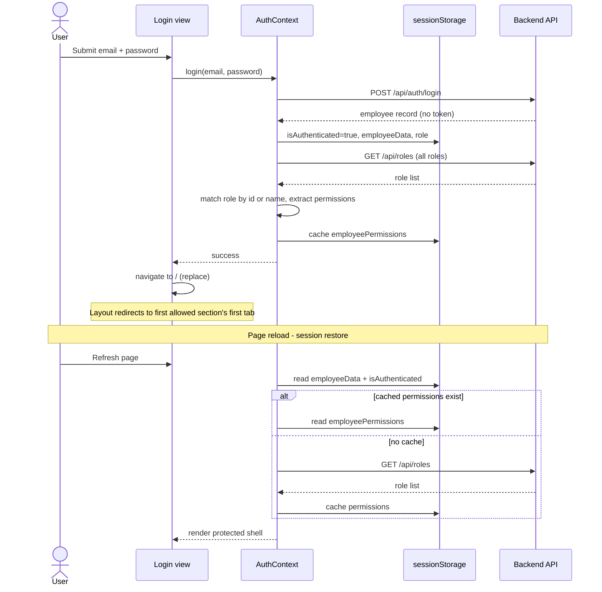
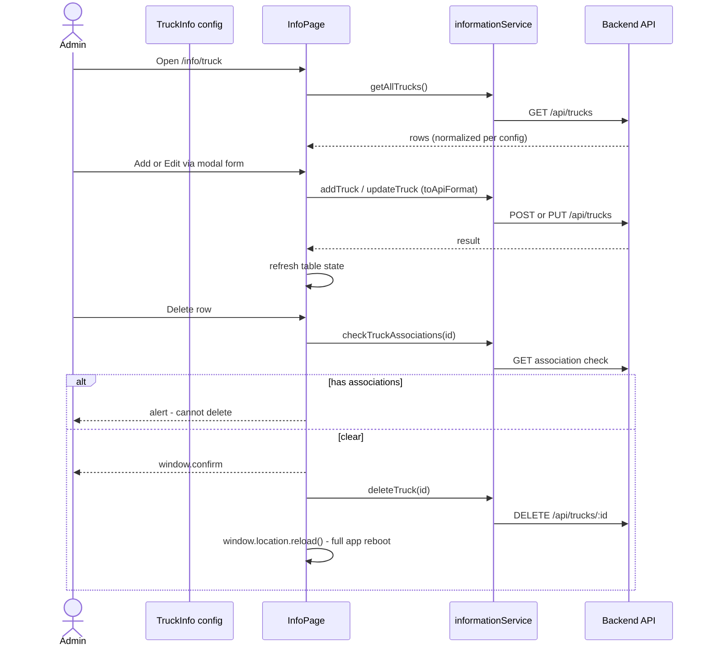
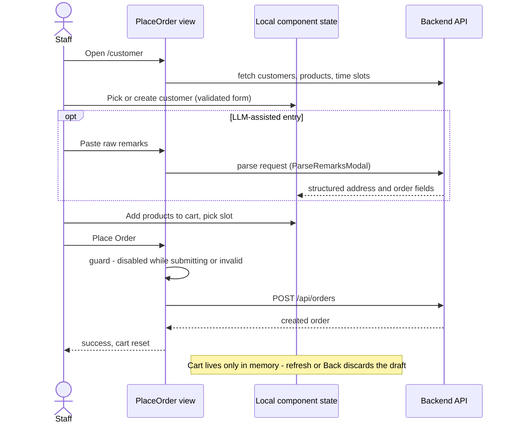
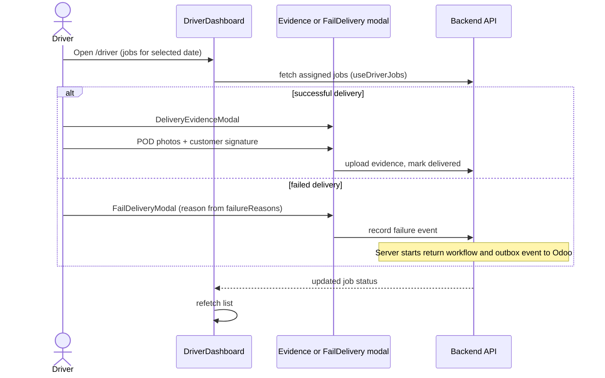

# CE Hub — Frontend Architecture

> Scope: `client/` (React SPA). Backend architecture is summarized only where it shapes frontend behavior.
> Companion document: [FRONTEND_FLOW_AUDIT.md](FRONTEND_FLOW_AUDIT.md) carries the detailed findings behind §6.

---

## 1. Architecture Overview

| Concern | Choice |
|---|---|
| Framework | React 18 (Create React App / `react-scripts` 5, not ejected) |
| Rendering | Client-side rendered SPA. No SSR, no code-splitting, no lazy routes — one bundle. |
| Routing | `react-router-dom` v6. Two-level design: a tiny public router in `App.js`, and a config-driven protected router generated inside `Layout.js`. |
| State management | React Context (`AuthContext`) for auth/permissions + local `useState`/custom hooks per feature. No Redux, no react-query/SWR — every page owns its own fetch lifecycle. |
| Data fetching | Plain `fetch()` against `${REACT_APP_API_BASE_URL}/api/*` (`utils/apiBaseUrl.js`). No shared client, no interceptors, no caching layer. |
| Session | `sessionStorage` (flag + employee record + cached permissions). No tokens, no expiry, no refresh — see §6. |
| Styling / UI | Tailwind CSS, `lucide-react` icons, `react-select`, Chart.js + Recharts for dashboards, `html5-qrcode` for scanning, `jspdf` for exports. |
| Dev proxy | `setupProxy.js` proxies `/api` → `http://localhost:4000` with `changeOrigin: false` (deliberate — see inline comment). |

**Core idea:** a single `navigationData` object in `Layout.js` is the source of truth for the sidebar, the top tabs, *and* the generated routes. A role's `permissions` array (strings fetched from `/api/roles`) is matched by key against `navigationData` — permission `"cases"` unlocks section `/cases`. `admin` unlocks everything.

---

## 2. Directory & Module Structure

```text
client/src/
├── App.js                     # Public routes + /* catch-all → ProtectedRoute → Layout
├── index.js                   # CRA entry
├── setupProxy.js              # /api → localhost:4000 dev proxy (changeOrigin: false is intentional)
├── contexts/
│   └── AuthContext.js         # login/logout, session restore, role→permission resolution
├── components/
│   ├── ProtectedRoute.js      # sessionStorage auth gate; redirects to /login
│   ├── Layout.js              # App shell: navigationData config, sidebar, tabs, inner <Routes>
│   ├── auth/                  # Login, ForgotPassword, ResetPassword (public pages)
│   ├── layout/                # BottomNav, MobileNavDrawer (field-mobile navigation)
│   ├── common/                # Shared primitives: Modal, ResultModal, InfoModal, FormField,
│   │                          #   InfoPage + InfoTable (config-driven CRUD engine),
│   │                          #   ScanStation, ScannerModal, NotificationBell, ProfileModal
│   ├── admin/                 # Office-side features
│   │   ├── dashboard/         #   Overview, EmployeePerformance, OrderPerformance, ActiveTripsPanel
│   │   ├── liveOps/           #   LiveDeliveries + TripDetailDrawer (?trip= deep link)
│   │   ├── schedule/          #   Schedule, AutoScheduleReview
│   │   ├── info/              #   Employee/Team/Building/Truck — thin configs over InfoPage
│   │   ├── access/            #   RoleAccessControl (edits the permission arrays)
│   │   └── *.js               #   Cases, IssueManagement, DeliveryIssues, SyncMonitor,
│   │                          #   CompletedDeliveries (+ several imported-but-unrouted legacy views)
│   ├── driver/                # DriverDashboard + modal stack (POD evidence, fail-delivery, etc.), DriverRoute
│   ├── delivery/  installer/                # Role schedule pages (only delivery/ is routed today;
│   │                                        #   warehouse/ was removed — see Addendum below)
│   ├── order/                 # PlaceOrder (cart flow), ManageOrders
│   └── employee/              # ReportIssue (available to all authenticated users at /reports)
├── hooks/                     # useIsMobile, useActiveTrips, useDriverJobs, useTripStatus, useGoogleMapsScript
├── services/
│   └── informationService.js  # API functions for the InfoPage CRUD domains
└── utils/                     # apiBaseUrl, navigationMode (nav partitioning / field-mobile detection),
                               # domain helpers (driverStatusMap, failureReasons, orderHelpers, …)
```

There is no `/routes` directory: routes live in `navigationData` inside `Layout.js` (`route` + `topNavItems[].path` per section).

---

## 3. Frontend Routing & Navigation Flow

```mermaid
flowchart TD
    Entry(["Browser entry"]) --> AppRouter{"App.js Routes"}

    subgraph PublicAuth["Public - no auth"]
        Login["/login"]
        Forgot["/forgot-password"]
        Reset["/reset-password?token="]
        Login -- "forgot link" --> Forgot
        Forgot -- "email sent" --> Login
        Reset -- "success after 3s" --> Login
        Reset -- "missing token" --> Forgot
    end

    AppRouter --> Login
    AppRouter --> Forgot
    AppRouter --> Reset
    AppRouter -- "/* catch-all" --> Guard{"ProtectedRoute:
    sessionStorage flag set?"}
    Guard -- "no" --> Login
    Login -- "login OK, navigate to /" --> Shell

    subgraph Shell["Layout shell - authenticated"]
        direction TB
        RootRedirect{"path is / or root
        not in allowed list?"}
        RootRedirect -- "yes" --> FirstAllowed["Redirect to first allowed
        section's first tab"]
        NoAccess["No-access screen
        (zero matching permissions)"]
        Header["Header on every page:
        Report Issue / NotificationBell /
        ProfileModal / Logout"]
        Reports["/reports - ReportIssue
        (any authenticated user)"]
        Header --> Reports
    end

    Guard -- "yes" --> RootRedirect

    subgraph Dashboard["/dashboard - permission: dashboard"]
        DOver["(index) Overview"]
        DLive["live-ops LiveDeliveries"]
        DDrawer["TripDetailDrawer
        ?trip= deep link"]
        DEmp["employee-performance"]
        DOrd["order OrderPerformance"]
        DLive --> DDrawer
    end

    subgraph Driver["/driver - permission: driver"]
        DrDash["(index) DriverDashboard"]
        DrRoute["route DriverRoute"]
        DrModals["Modals: UpdateOrder,
        DeliveryEvidence, ContactReport,
        FailDelivery, DateCalendar"]
        DrDash --> DrModals
    end

    subgraph SchedGrp["/schedule - permission: schedule"]
        Sch["(index) Schedule"]
        AutoSch["auto-scheduler AutoScheduleReview"]
    end

    subgraph Info["/info - permission: info"]
        InfoPage["InfoPage CRUD engine"]
        IEmp["(index) Employee"] --> InfoPage
        ITeam["team"] --> InfoPage
        IBld["building"] --> InfoPage
        ITrk["truck"] --> InfoPage
    end

    subgraph Cases["/cases - permission: cases"]
        CRep["(index) Cases reports"]
        COrd["order-issues
        ?orderId= deep link"]
        CDel["delivery-issues
        ?orderId= deep link"]
        CSync["sync-monitor"]
        CDone["completed-deliveries"]
    end

    subgraph Orders["/customer - permission: customer"]
        Place["(index) PlaceOrder cart flow"]
        Parse["ParseRemarksModal
        LLM address parse"]
        Manage["manage-orders ManageOrders"]
        Place --> Parse
    end

    subgraph Scanning["/scanning - permission: scanning"]
        SLoad["loading"]
        SUnload["unloading"]
        SAudit["audit - admin only
        (tab filter is UI-only)"]
    end

    subgraph Singles["Single-tab sections"]
        Access["/access - RoleAccessControl"]
        Deliv["/delivery - DeliverySchedule"]
        Settings["/settings - NotificationSettings"]
    end

    FirstAllowed --> Dashboard
    FirstAllowed --> Driver
    RootRedirect -- "no, root allowed" --> Dashboard
    RootRedirect --> Driver
    RootRedirect --> SchedGrp
    RootRedirect --> Info
    RootRedirect --> Cases
    RootRedirect --> Orders
    RootRedirect --> Scanning
    RootRedirect --> Singles
    RootRedirect -- "no permissions at all" --> NoAccess

    Bell["NotificationBell"] -- "deep link" --> COrd
    Bell -- "deep link" --> CDel
    Trips["ActiveTripsPanel"] -- "?trip=" --> DLive
```



Navigation chrome adapts by audience (`utils/navigationMode.js`): desktop sidebar; mobile drawer for office users; bottom nav + overflow drawer for field-only users (driver / delivery / installation / scanning permissions and no office keys).

---

## 4. Key User Journey Sequence Diagrams

### 4.1 Authentication and session restore

There is **no token issuance and no refresh flow** — login returns the employee record, and "session" is a sessionStorage flag restored on reload.



### 4.2 Reference-data CRUD via the InfoPage engine

Trucks, buildings, teams, and employees all flow through the same config-driven component.



### 4.3 Order placement (cart flow)



### 4.4 Driver delivery completion and failure



---

## 5. State Management & Data Flow

- **Auth and permissions** are the only global state, held in `AuthContext` and mirrored to `sessionStorage`. Everything else is feature-local: each page fetches on mount with `useState`/`useEffect` (sometimes wrapped in a custom hook such as `useActiveTrips` or `useDriverJobs`) and owns its own loading/error flags.
- **No caching layer.** Every navigation refetches; there is no react-query/SWR, no normalized store, and no cross-page sharing of fetched data. Permissions are the one cached value — written to `sessionStorage` at login and never invalidated.
- **No optimistic updates.** Mutations are pessimistic: await the API, then refetch or update local state. Three info pages sidestep even that with `window.location.reload()`.
- **No error boundaries.** There is no `ErrorBoundary` component anywhere in `client/src`; a render-time exception in any view unmounts the whole app to a blank screen. Fetch errors are handled per-page with ad-hoc patterns ranging from inline banners to `alert()` to silent `console.error`.
- **URL as state** is used well in three places (`?trip=` in live-ops, `?orderId=` in the two issue queues) and nowhere else; all other filters are in-memory and reset on refresh.
- **API base resolution** (`utils/apiBaseUrl.js`) prefers `REACT_APP_API_BASE_URL`, falling back to a runtime guess derived from `window.location` — which is what lets the same build work on localhost, LAN, and the IIS deployment.

---

## 6. Technical Debt & Architectural Bottlenecks

Full detail with line references in [FRONTEND_FLOW_AUDIT.md](FRONTEND_FLOW_AUDIT.md).

- **Missing route guards (critical):** routes are generated from the full `navigationData` rather than the permission-filtered list, and enforcement is a post-render redirect effect — unauthorized components mount and fetch before redirecting. Tab-level `allowedRoles` (e.g. admin-only `/scanning/audit`) only hide buttons; direct URLs render the view.
- **Auth is client-side only:** the session is a spoofable `sessionStorage` flag, the backend issues no token and has no auth middleware, and `GET /api/roles` exposes every role's permission map to unauthenticated callers. Permissions cached at login never refresh, so revocation is inert until the tab closes.
- **No 404 route:** unknown roots silently redirect to the first allowed section; unknown sub-paths under an allowed root render an empty content pane.
- **Duplicate views:** `delivery/DelSchedule.js` and `installer/InsSchedule.js` are divergent copies of one schedule page (`warehouse/truckSchedule.js`, the third leg, was removed — see Addendum below); only the first is routed, yet both ship in the bundle. Six more components (`ComplaintManagement`, `OrderIssues`, `DoAssignment`, `FailureNotificationLog`, `ProductInfo`, `TruckZoneInfo`) are imported into `Layout.js` but unrouted.
- **Mirrored routing state:** `activeSection`/`topNavActive` duplicate `location.pathname` and are re-synced by a 55-line effect; nav items are buttons instead of `NavLink`s, so tab highlight can desync and links aren't real links.
- **Fragmented navigation and feedback:** hardcoded path strings across ten files with no route-constants module; 40+ `alert()`/`window.confirm()` call sites alongside the purpose-built modal components; `window.location.reload()` used as a refresh mechanism in three info pages.
- **No circular dependencies detected** in `client/src` — the module graph is a clean tree (Layout imports features; features import common/services/utils; nothing imports back into Layout). The structural risk is concentration, not cycles: `Layout.js` is a god module owning nav config, routing, guards, and shell UI.
- **Bundle/performance:** no route-level code-splitting; the driver's mobile bundle carries the entire admin surface (charts, jsPDF, scanner) and vice versa.
- **Draft fragility:** the 991-line `PlaceOrder` cart and driver POD evidence are memory-only; refresh, Back, or a dropped modal discards work with no warning and no persistence.

### Addendum (2026-09-07): Warehouse scope cut

Per stakeholder decision, only **salesperson, delivery team, and admin** use this app going
forward — warehouse runs its own separate system. This retired the in-app `warehouse`/
`storekeeper` role, the `warehouse/truckSchedule.js` page (one leg of the DRY-L-2c/2d clone
group above — now a 2-way clone, delivery/installer only), the Return-Logistics feature
(A.5.5–A.5.8: Return DO creation, stock-to-quarantine transfer, storekeeper scan-to-receive,
Odoo inventory update on return — never wired to real Odoo calls), the Order Re-entry feature
(A.5.9–A.5.11, gated entirely on that return state), and the warehouse-team auto-assignment
branch of the order-scheduling flow. **Code/UI removal (Phase A) has landed**; the schema
migration dropping `delivery_returns`/`delivery_workflows`/`warehouse_team_id`/return columns
(Phase B) is written but deliberately not yet applied — see
[AUDIT.md](AUDIT.md#addendum-2026-09-07-warehouse-scope-cut--stakeholder-decision) for the
full list of what changed and what Phase B still needs to do.
